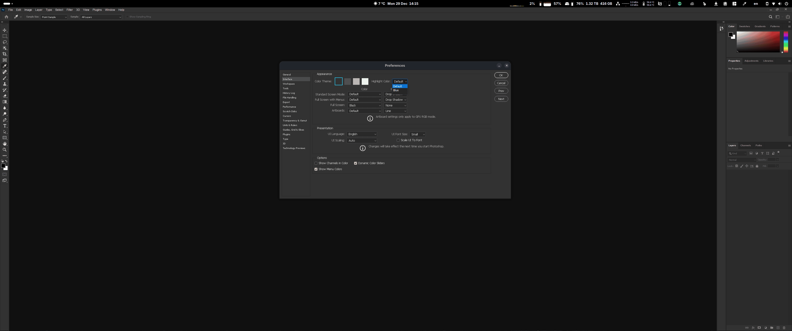

# Photoshop CC 2021 for Linux

A complete installer for Adobe Photoshop CC 2021 on Linux using Wine 9.0. This installer includes Camera Raw support, automatic appearance configuration, and provides an isolated Wine environment for maximum compatibility.

**DISCLAIMER:**
**Please use this software only if you have an active Photoshop subscription. I'm not responsible for any use without subscription.**

## Features

- **Photoshop CC 2021** with full compatibility
- **Camera Raw 14.3** included and pre-installed (CR version)
- **Wine 9.0** isolated installation (doesn't affect system Wine)
- **DXVK and VKD3D** for better graphics performance
- **Automatic appearance configuration** with dark theme support
- **Parallel downloads** for faster installation
- **Checksum verification** for all downloads
- **Desktop integration** with application launcher and icon
- **Colored progress output** with detailed installation steps
- **Caching support** to avoid re-downloading components



## Requirements

- **Linux distribution** (tested on Ubuntu, Fedora, openSUSE, Arch)
- **Minimum system requirements:**
  - 10GB free disk space
  - 4GB RAM
- **Required utilities:**
  - tar
  - wget
  - curl
  - sha256sum
  - xdotool (for appearance configuration)
- **Optional utilities:**
  - gdown (for Google Drive downloads)
  - 7z (for Camera Raw installation)
- **Vulkan-capable GPU or APU** (older GPUs may encounter issues)
- **Write permissions** to the installation directory
- **Active internet connection** (downloads ~2GB of data)

### Installing Dependencies

#### Ubuntu/Debian:
```bash
sudo apt update
sudo apt install tar wget curl sha256sum xdotool p7zip-full
# Optional for Google Drive downloads:
sudo apt install gdown
```

#### Fedora:
```bash
sudo dnf install tar wget curl sha256sum xdotool p7zip
# Optional for Google Drive downloads:
sudo dnf install gdown
```

#### Arch:
```bash
sudo pacman -S tar wget curl xdotool p7zip
# Optional for Google Drive downloads:
yay -S gdown
```

## Installation

### Running Directly (Without Cloning)

You can run any of the scripts directly from the repository without cloning:

#### Installation Scripts

```bash
# Install with Camera Raw (Recommended)
curl -sSL https://raw.githubusercontent.com/eboye/LinuxPS/main/scripts/photoshop2021installcr.sh | bash -s -- /path/to/install/directory

# Install without Camera Raw
curl -sSL https://raw.githubusercontent.com/eboye/LinuxPS/main/scripts/photoshop2021install.sh | bash -s -- /path/to/install/directory

# Verbose installation with Camera Raw
curl -sSL https://raw.githubusercontent.com/eboye/LinuxPS/main/scripts/photoshop2021installcr.sh | bash -s -- -v /path/to/install/directory

# Skip appearance configuration
curl -sSL https://raw.githubusercontent.com/eboye/LinuxPS/main/scripts/photoshop2021install.sh | bash -s -- --skip-appearance /path/to/install/directory
```

#### Uninstaller Script

```bash
# Uninstall Photoshop
curl -sSL https://raw.githubusercontent.com/eboye/LinuxPS/main/scripts/uninstaller.sh | bash -s -- /path/to/install/directory

# Uninstall and purge cache
curl -sSL https://raw.githubusercontent.com/eboye/LinuxPS/main/scripts/uninstaller.sh | bash -s -- --purge /path/to/install/directory
```

### Standard Installation

#### Clone the repository
```bash
git clone https://github.com/eboye/LinuxPS.git
cd LinuxPS
```

#### Install with Camera Raw (Recommended)
```bash
./scripts/photoshop2021installcr.sh /path/to/install/directory
```

#### Install without Camera Raw
```bash
./scripts/photoshop2021install.sh /path/to/install/directory
```

## Script Parameters

### Install Scripts

```bash
./scripts/photoshop2021install[cr].sh [OPTIONS] /path/to/install/directory
```

**Options:**
- `-v, --verbose` - Show detailed output during installation
- `-V, --version` - Show installer version information
- `-n, --dry-run` - Show what would be done without executing
- `-k, --keep-cache` - Keep downloaded files in cache directory
- `-s, --skip-verify` - Skip checksum verification (not recommended)
- `--skip-appearance` - Skip automatic appearance configuration

**Arguments:**
- `/path/to/install/directory` - Where Photoshop will be installed (absolute or relative path)

### Uninstaller Script

```bash
./scripts/uninstaller.sh [OPTIONS] /path/to/install/directory
```

**Options:**
- `-v, --verbose` - Show detailed output during uninstallation
- `-p, --purge` - Remove all files including cached downloads
- `-h, --help` - Show help message

## Installation Process

The installer performs the following steps:

1. **System Requirements Check** - Verifies disk space, RAM, and required commands
2. **Wine 9.0 Setup** - Downloads and extracts isolated Wine 9.0
3. **Winetricks Configuration** - Downloads and sets up winetricks
4. **Wine Prefix Initialization** - Creates Windows 10 environment
5. **Redistributables Installation** - Downloads and installs VC++ runtimes
6. **Photoshop Extraction** - Extracts Photoshop from archive
7. **Component Installation** - Installs fonts, libraries, DXVK, and VKD3D
8. **Photoshop Installation** - Moves Photoshop to Wine prefix
9. **Launcher Creation** - Creates launch script
10. **Appearance Configuration** - Auto-runs Photoshop and applies dark theme (optional)

## Usage

After installation, you can launch Photoshop in two ways:

1. **Using the launcher script:**
   ```bash
   /path/to/install/directory/launch-photoshop.sh
   ```

2. **Directly through Wine:**
   ```bash
   cd /path/to/install/directory
   export PATH="$PWD/wine-9.0/bin:$PATH"
   export WINEPREFIX="$PWD/Adobe-Photoshop"
   wine "Adobe-Photoshop/drive_c/Program Files/Adobe/Adobe Photoshop 2021/Photoshop.exe"
   ```

### Appearance Configuration

The installer automatically configures Photoshop for better Linux integration:

- **Dark Windows theme** for native dialogs
- **Font antialiasing** with RGB subpixel rendering
- **Improved font rendering** to match desktop environment

This requires Photoshop to run once during installation. The process:
1. Launches Photoshop in the background
2. Waits for the window to appear (using xdotool)
3. Closes Photoshop after initialization
4. Applies registry settings for appearance

If you prefer to skip this step, use the `--skip-appearance` flag.

### Camera Raw Configuration

If you encounter issues with Camera Raw:

1. Open Photoshop
2. Go to **Edit → Preferences → Camera Raw... → Performance**
3. Set **"Use graphics processor"** to **Off**
4. If Camera Raw is grayed out, go to **Edit → Preferences → Tools** and uncheck **"Show Tooltips"**

## Uninstallation

To completely remove Photoshop:

```bash
./scripts/uninstaller.sh /path/to/install/directory
```

The uninstaller will remove:
- Photoshop installation
- Wine 9.0 installation
- Desktop entries and icons
- Configuration files
- Empty installation directory (if applicable)

Use `--purge` to also remove cached downloads:
```bash
./scripts/uninstaller.sh --purge /path/to/install/directory
```

## File Structure After Installation

```
/path/to/install/directory/
├── Adobe-Photoshop/          # Wine prefix and Photoshop files
│   ├── drive_c/
│   │   ├── Program Files/Adobe/Adobe Photoshop 2021/
│   │   └── users/            # User settings and registry
│   └── ...                   # Wine configuration files
├── wine-9.0/                 # Isolated Wine 9.0 installation
│   ├── bin/
│   ├── lib/
│   └── lib64/
├── winetricks               # Winetricks script
├── allredist/               # VC++ redistributables
└── launch-photoshop.sh      # Launch script
```

## Cache Directory

Downloaded files are cached in `~/.cache/photoshop2021-installer` (or `~/.cache/photoshop2021cr-installer` for CR version) to avoid re-downloading on subsequent installations. Use `--keep-cache` to preserve the cache, or delete it manually to save space.

## Troubleshooting

### Common Issues

1. **"Wine is not working correctly"**
   - Ensure you have proper permissions in the installation directory
   - Check if all dependencies are installed
   - Try running with verbose mode (`-v`)

2. **"Missing required commands"**
   - Install the missing dependencies listed in the error
   - On Ubuntu/Debian: `sudo apt install tar wget curl sha256sum xdotool`

3. **Checksum verification failed**
   - The download may be corrupted - try again
   - Use `--skip-verify` to bypass (not recommended for security)

4. **Photoshop won't launch**
   - First launch may take longer as Wine configures components
   - Check if all redistributables were installed successfully
   - Try running the launch script directly

5. **Appearance configuration failed**
   - Ensure xdotool is installed
   - Check if a display is available (not running in headless mode)
   - Use `--skip-appearance` to skip this step

### Performance Optimization

1. **Enable GPU acceleration** (if supported):
   - In Photoshop: Edit → Preferences → Performance
   - Check "Use Graphics Processor"
   - Set to "Advanced" mode

2. **Increase memory usage**:
   - Edit → Preferences → Performance
   - Set "Let Photoshop use" to 70-80% of available RAM

3. **Optimize scratch disks**:
   - Use fast SSD for primary scratch disk
   - Avoid using system drive as scratch disk

### Getting Help

When reporting issues, please include:
- Your Linux distribution and version
- The exact command used
- Verbose output (`-v` flag) if available
- Any error messages
- Hardware specifications (GPU, RAM)

## Development

### Project Structure

```
LinuxPS/
├── lib/
│   └── common.sh           # Shared functions for all scripts
├── scripts/
│   ├── photoshop2021install.sh      # Main installer
│   ├── photoshop2021installcr.sh    # CR version installer
│   └── uninstaller.sh               # Uninstaller
├── configure-ps-appearance.sh       # Appearance configuration (integrated)
└── README.md
```

### Shared Functions

All scripts use `lib/common.sh` for common functionality:
- Logging and color output
- System requirements checking
- Download and checksum verification
- Wine environment setup
- Appearance configuration

## Special Thanks

- **The WineHQ team** - For making Wine possible
- **Kron4ek** - For providing Wine builds
- **Winetricks project** - For Windows component installation
- **Adobe** - For making Photoshop (please release an official Linux version!)
