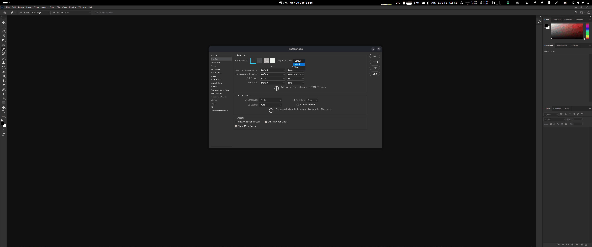

# Adobe Creative Suite for Linux

A complete suite of installers for Adobe Creative Cloud applications on Linux using Wine 9.0. This project provides installers for Photoshop CC 2021, Illustrator CC 17, and Illustrator 2021 with automatic desktop integration, backup/restore functionality, and unified management through a TUI interface.

**DISCLAIMER:**
**Please use this software only if you have active Adobe subscriptions. I'm not responsible for any use without subscription.**

## 🎨 Supported Applications

- **Photoshop CC 2021** - Full compatibility with Camera Raw 14.3 (CR version)
- **Illustrator CC 17** - Legacy Illustrator with full feature support
- **Illustrator 2021** - Latest Illustrator with modern features

## ✨ Features

### For All Applications
- **Wine 9.0** isolated installation (doesn't affect system Wine)
- **DXVK and VKD3D** for better graphics performance
- **Automatic dark theme** with Windows 10 mode
- **Parallel downloads** for faster installation
- **Checksum verification** for all downloads
- **Desktop integration** with application launchers and icons
- **Colored progress output** with detailed installation steps
- **Caching support** to avoid re-downloading components
- **Backup and restore** functionality
- **Unified TUI manager** for easy script management



### Photoshop Specific
- **Camera Raw 14.3** included and pre-installed (CR version)
- **Automatic appearance configuration** with font antialiasing

### Illustrator Specific
- **Custom Wine builds** (Illustrator 2021) or optimized system Wine
- **Vector graphics optimization** with proper font rendering
- **CMYK color support** through Wine components

## 📋 Requirements

- **Linux distribution** (tested on Ubuntu, Fedora, openSUSE, Arch)
- **Minimum system requirements:**
  - 10GB free disk space per application
  - 4GB RAM
- **Required utilities:**
  - tar, wget, curl, sha256sum
  - dialog or whiptail (for TUI manager)
- **Optional utilities:**
  - gdown (for Google Drive downloads)
  - 7z (for Camera Raw installation)
  - xdotool (for appearance configuration)
- **Vulkan-capable GPU or APU** (older GPUs may encounter issues)
- **Write permissions** to the installation directory
- **Active internet connection** (downloads ~2-3GB per application)
- **For Illustrator 2021:** Custom Wine file in project root (see Quick Start)

### Installing Dependencies

#### Ubuntu/Debian:
```bash
sudo apt update
sudo apt install tar wget curl sha256sum dialog p7zip-full
# Optional:
sudo apt install gdown xdotool
```

#### Fedora:
```bash
sudo dnf install tar wget curl sha256sum dialog p7zip
# Optional:
sudo dnf install gdown xdotool
```

#### Arch:
```bash
sudo pacman -S tar wget curl sha256sum dialog p7zip
# Optional:
yay -S gdown xdotool
```

## 🚀 Quick Start

### ⚠️ Important: Illustrator 2021 Custom Wine Requirement

**For optimal Illustrator 2021 performance**, you need to download and place the custom Wine in the project root:

```bash
# Download the custom Wine (required for Illustrator 2021)
wget -O wine-illustrator-custom.tar.xz "https://web.archive.org/web/20231024185932if_/https://lulucloud.mywire.org/FileHosting/GithubProjects/Illustrator/wine-illustrator-custom.tar.xz"

# Place it in the project root directory
mv wine-illustrator-custom.tar.xz /path/to/LinuxPS/
```

**Why this is needed:**
- Provides better GPU acceleration for Illustrator 2021
- Fixes settings rendering issues
- Ensures proper DirectX compatibility
- Eliminates Wine version conflicts

**Without this file, Illustrator 2021 will fall back to system Wine** which may have GPU acceleration issues.

### Using the TUI Manager (Recommended)

The easiest way to manage all Adobe applications is using the unified TUI manager:

```bash
./scripts/photoshop-manager.sh
```

This provides a user-friendly menu to:
- Install any Adobe application (Photoshop, Illustrator CC 17, Illustrator 2021)
- Uninstall applications
- Create backups and restore installations
- Manage desktop entries
- Access utilities and system information

### Running Directly (Without Cloning)

You can run any script directly from the repository:

#### TUI Manager
```bash
curl -sSL https://raw.githubusercontent.com/eboye/LinuxPS/main/scripts/photoshop-manager.sh | bash
```

#### Photoshop Installers
```bash
# With Camera Raw (Recommended)
curl -sSL https://raw.githubusercontent.com/eboye/LinuxPS/main/scripts/photoshop2021installcr.sh | bash -s -- /path/to/install/directory

# Standard version
curl -sSL https://raw.githubusercontent.com/eboye/LinuxPS/main/scripts/photoshop2021install.sh | bash -s -- /path/to/install/directory
```

#### Illustrator Installers
```bash
# Illustrator CC 17
curl -sSL https://raw.githubusercontent.com/eboye/LinuxPS/main/scripts/illustrator2021installcr.sh | bash -s -- /path/to/install/directory

# Illustrator 2021 (requires local AdobeIllustrator2021.tar.xz)
curl -sSL https://raw.githubusercontent.com/eboye/LinuxPS/main/scripts/illustrator2021install.sh | bash -s -- /path/to/install/directory
```

## 📦 Standard Installation

### Clone the repository
```bash
git clone https://github.com/eboye/LinuxPS.git
cd LinuxPS
```

### Install Applications

#### Photoshop
```bash
# With Camera Raw (Recommended)
./scripts/photoshop2021installcr.sh /path/to/install/directory

# Standard version
./scripts/photoshop2021install.sh /path/to/install/directory
```

#### Illustrator CC 17
```bash
./scripts/illustrator2021installcr.sh /path/to/install/directory
```

#### Illustrator 2021
```bash
# Requires AdobeIllustrator2021.tar.xz in project root or specified location
# AND wine-illustrator-custom.tar.xz in project root (see Quick Start section)
./scripts/illustrator2021install.sh /path/to/install/directory
```

**Prerequisites for Illustrator 2021:**
- `AdobeIllustrator2021.tar.xz` - Illustrator application files
- `wine-illustrator-custom.tar.xz` - Custom Wine for optimal GPU performance

Download the custom Wine:
```bash
wget -O wine-illustrator-custom.tar.xz "https://web.archive.org/web/20231024185932if_/https://lulucloud.mywire.org/FileHosting/GithubProjects/Illustrator/wine-illustrator-custom.tar.xz"
```

## ⚙️ Script Parameters

### Install Scripts

```bash
./scripts/[app]install[cr].sh [OPTIONS] /path/to/install/directory
```

**Common Options:**
- `-v, --verbose` - Show detailed output during installation
- `-V, --version` - Show installer version information
- `-n, --dry-run` - Show what would be done without executing
- `-k, --keep-cache` - Keep downloaded files in cache directory
- `-s, --skip-verify` - Skip checksum verification (not recommended)

**Photoshop Specific:**
- `--skip-appearance` - Skip automatic appearance configuration

**Illustrator 2021 Specific:**
- `--no-desktop` - Skip desktop entry creation

### TUI Manager

```bash
./scripts/photoshop-manager.sh
```

Provides interactive menu with checkboxes for:
- Verbose output
- Cache management
- Checksum verification
- Desktop entry creation (Illustrator 2021)
- Application selection
- Path input with tab completion

## 📂 Installation Process

All installers follow a similar process:

1. **System Requirements Check** - Verifies disk space, RAM, and required commands
2. **Wine 9.0 Setup** - Downloads and extracts isolated Wine 9.0
3. **Winetricks Configuration** - Downloads and sets up winetricks
4. **Wine Prefix Initialization** - Creates Windows 10 environment
5. **Dark Theme Application** - Applies dark theme to Windows UI
6. **Redistributables Download** - Downloads VC++ runtimes
7. **Application Extraction** - Extracts application from archive
8. **Wine Components Installation** - Installs fonts, libraries, DXVK, VKD3D
9. **Application Installation** - Moves application to Wine prefix
10. **VC++ Redistributables Installation** - Installs Visual C++ runtimes
11. **Launcher Creation** - Creates launch script
12. **Desktop Entry Creation** - Creates desktop integration (all apps)

## 🎮 Usage

After installation, you can launch applications in multiple ways:

### Using Launcher Scripts
```bash
# Photoshop
/path/to/install/directory/launch-photoshop.sh

# Illustrator CC 17
/path/to/install/directory/launch-illustrator.sh

# Illustrator 2021
/path/to/install/directory/launch-illustrator.sh
```

### Desktop Integration
- **Applications menu** - All applications create desktop entries automatically
- **Launchers** - Available in Graphics category
- **Icons** - Custom icons for each application

### Direct Wine Execution
```bash
cd /path/to/install/directory
export PATH="$PWD/wine-9.0/bin:$PATH"
export WINEPREFIX="$PWD/Adobe-[App]"
wine "drive_c/Program Files/[App Path]/[Executable]"
```

## 🗂️ Uninstallation

To completely remove any Adobe application:

```bash
# Photoshop
./scripts/uninstaller.sh /path/to/install/directory

# Illustrator CC 17
./scripts/uninstall-illustrator.sh /path/to/install/directory

# Illustrator 2021
./scripts/uninstall-illustrator2021.sh /path/to/install/directory
```

Use `--purge` to also remove cached downloads:
```bash
./scripts/[uninstaller].sh --purge /path/to/install/directory
```

## 💾 Backup and Restore

All applications include backup and restore functionality for easy migration between machines or creating safe backups.

### Creating Backups

```bash
# Photoshop
./scripts/backup-photoshop.sh /path/to/photoshop/installation

# Illustrator CC 17
./scripts/backup-illustrator.sh /path/to/illustrator/installation

# Illustrator 2021
./scripts/backup-illustrator2021.sh /path/to/illustrator2021/installation
```

**Backup Options:**
- `-o, --output DIR` - Specify output directory
- `--no-compress` - Create uncompressed tarball
- `-v, --verbose` - Show detailed output

### Restoring from Backups

```bash
./scripts/restore-[app].sh backup-file.tar.xz /new/installation/path
```

The restore script automatically:
- Updates all paths in launcher scripts
- Updates desktop entries if present
- Recreates Wine symlinks
- Fixes permissions for the new system

**Restore Options:**
- `-k, --keep-permissions` - Keep original file permissions
- `-v, --verbose` - Show detailed output

## 🖥️ Desktop Integration

All installers automatically create desktop entries with:
- Application menu entries in Graphics category
- Proper icon integration
- File association support
- StartupWMClass for proper window grouping

### Manual Desktop Entry Creation

```bash
# Photoshop
./scripts/create-desktop-entry.sh /path/to/photoshop/installation

# Illustrator CC 17
./scripts/create-illustratorCC17-desktop.sh /path/to/illustrator/installation

# Illustrator 2021
./scripts/create-illustrator2021-desktop.sh /path/to/installation
```

**Desktop Entry Options:**
- `-n, --name NAME` - Custom name for desktop entry
- `-i, --icon PATH` - Path to custom icon file
- `-f, --force` - Overwrite existing desktop entry

## 📁 File Structure After Installation

```
/path/to/install/directory/
├── Adobe-[App]/              # Wine prefix and application files
│   ├── drive_c/
│   │   └── Program Files/[App Path]/
│   └── users/                  # User settings and registry
├── wine-9.0/                 # Isolated Wine 9.0 installation
│   ├── bin/
│   ├── lib/
│   └── lib64/
├── winetricks               # Winetricks script
├── allredist/               # VC++ redistributables
└── launch-[app].sh          # Launch script
```

## 🗄️ Cache Directory

Downloaded files are cached in:
- `~/.cache/photoshop2021cr-installer` (Photoshop CR)
- `~/.cache/photoshop2021-installer` (Photoshop Standard)
- `~/.cache/illustratorcc17-installer` (Illustrator CC 17)
- `~/.cache/illustrator2021cr-installer` (Illustrator 2021)

Use `--keep-cache` to preserve cache, or delete to save space.

## 🔧 Troubleshooting

### Common Issues

1. **"Wine is not working correctly"**
   - Ensure proper permissions in installation directory
   - Check if all dependencies are installed
   - Try running with verbose mode (`-v`)

2. **"Missing required commands"**
   - Install missing dependencies listed in error message
   - Ubuntu/Debian: `sudo apt install tar wget curl sha256sum dialog`

3. **"Checksum verification failed"**
   - Download may be corrupted - try again
   - Use `--skip-verify` to bypass (not recommended for security)

4. **Application won't launch**
   - First launch may take longer as Wine configures components
   - Check if all redistributables were installed successfully
   - Try running the launch script directly

5. **Appearance configuration failed**
   - Ensure xdotool is installed
   - Check if display is available (not headless mode)
   - Use `--skip-appearance` to skip this step

### Performance Optimization

1. **Enable GPU acceleration** (if supported):
   - In application: Edit → Preferences → Performance
   - Check "Use Graphics Processor"
   - Set to "Advanced" mode

2. **Increase memory usage**:
   - Edit → Preferences → Performance
   - Set "Let [App] use" to 70-80% of available RAM

3. **Optimize scratch disks**:
   - Use fast SSD for primary scratch disk
   - Avoid using system drive as scratch disk

## 🏗️ Project Structure

```
LinuxPS/
├── lib/
│   └── common.sh           # Shared functions for all scripts
├── scripts/
│   ├── photoshop-manager.sh           # Unified TUI manager
│   ├── photoshop2021install.sh       # Photoshop standard installer
│   ├── photoshop2021installcr.sh     # Photoshop CR installer
│   ├── illustrator2021installcr.sh    # Illustrator CC 17 installer
│   ├── illustrator2021install.sh      # Illustrator 2021 installer
│   ├── uninstaller.sh                # Photoshop uninstaller
│   ├── uninstall-illustrator.sh      # Illustrator CC 17 uninstaller
│   ├── uninstall-illustrator2021.sh  # Illustrator 2021 uninstaller
│   ├── backup-photoshop.sh           # Photoshop backup script
│   ├── backup-illustrator.sh         # Illustrator CC 17 backup script
│   ├── backup-illustrator2021.sh    # Illustrator 2021 backup script
│   ├── restore-photoshop.sh          # Photoshop restore script
│   ├── restore-illustrator.sh        # Illustrator CC 17 restore script
│   ├── restore-illustrator2021.sh     # Illustrator 2021 restore script
│   ├── create-desktop-entry.sh       # Photoshop desktop entry
│   ├── create-illustratorCC17-desktop.sh # Illustrator CC 17 desktop entry
│   └── create-illustrator2021-desktop.sh # Illustrator 2021 desktop entry
└── README.md
```

## 🙏 Credits and Thanks

### Adobe Applications
- **Adobe** - For creating amazing creative applications (please release official Linux versions!)

### Wine and Components
- **The WineHQ team** - Making Windows applications possible on Linux
- **Kron4ek** - Providing optimized Wine builds
- **Winetricks project** - Windows component installation

### Illustrator Projects
- **Illustrator 2021 Linux** - [IverCoder/Illustrator-2021-Linux](https://github.com/IverCoder/Illustrator-2021-Linux)
  - For the Illustrator 2021 foundation and custom Wine approach
- **Illustrator CC17 Linux** - [FabrizioTorrico/illustratorcc17-linux](https://github.com/FabrizioTorrico/illustratorcc17-linux)
  - For the original Illustrator CC 17 Linux implementation

### Photoshop Projects
- **Photoshop CC 2022 Linux** - [LinSoftWin/Photoshop-CC2022-Linux](https://github.com/LinSoftWin/Photoshop-CC2022-Linux)
  - For the latest Photoshop CC 2022 foundation and modern approach

### Community Contributions
- **Linux community** - For testing, feedback, and improvements
- **Wine community** - For compatibility workarounds and optimizations
- **Creative professionals** - For real-world usage and bug reports

## 📄 License

This project is for educational and personal use only. Please respect Adobe's licensing terms and ensure you have valid subscriptions for any Adobe software you install.

---

**Enjoy your Adobe Creative Suite on Linux!** 🎨✨
